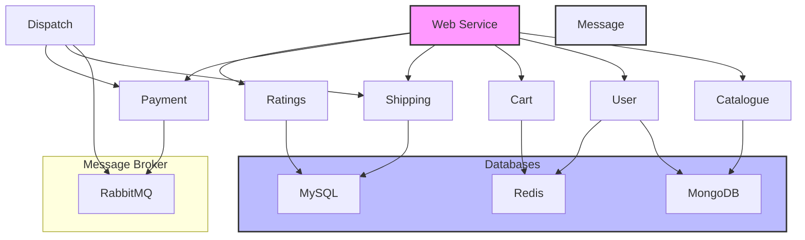

# Robot Shop Microservices Architecture Documentation

## Overview
The Robot Shop is a sample e-commerce application built using a microservices architecture. It demonstrates various microservices patterns and best practices in a real-world scenario. The application consists of multiple independent services that work together to provide a complete e-commerce experience.

## Service Dependencies

## Core Services

### 1. Web Service (`web`)
- Frontend application that serves the user interface
- Acts as the main entry point for users
- Communicates with other microservices to provide a complete shopping experience
- Exposed on port 8080

### 2. Catalogue Service (`catalogue`)
- Manages product catalog and inventory
- Stores product information in MongoDB
- Provides product listing and details
- Implements health checks for monitoring

### 3. User Service (`user`)
- Handles user authentication and management
- Stores user data in MongoDB
- Uses Redis for session management
- Implements health checks for monitoring

### 4. Cart Service (`cart`)
- Manages shopping cart functionality
- Uses Redis for cart data storage
- Provides cart operations (add, remove, update)
- Implements health checks for monitoring

### 5. Payment Service (`payment`)
- Processes payment transactions
- Integrates with external payment gateway (WorldPay)
- Uses RabbitMQ for asynchronous message processing
- Implements health checks for monitoring

### 6. Shipping Service (`shipping`)
- Handles order shipping and delivery
- Stores shipping data in MySQL
- Provides shipping status updates
- Implements health checks for monitoring

### 7. Ratings Service (`ratings`)
- Manages product ratings and reviews
- Stores rating data in MySQL
- Provides rating statistics and reviews
- Implements health checks for monitoring

### 8. Dispatch Service (`dispatch`)
- Handles order dispatch and fulfillment
- Uses RabbitMQ for message processing
- Coordinates between shipping and payment services

## Supporting Services

### 1. MongoDB (`mongodb`)
- Primary database for catalogue and user services
- Stores product and user information

### 2. MySQL (`mysql`)
- Database for shipping and ratings services
- Stores shipping and rating data

### 3. Redis (`redis`)
- In-memory data store
- Used for session management and cart data
- Provides fast access to frequently accessed data

### 4. RabbitMQ (`rabbitmq`)
- Message broker for asynchronous communication
- Used by payment and dispatch services
- Enables loose coupling between services

## Infrastructure Components

### 1. Load Generator (`load-gen`)
- Simulates user traffic for testing
- Helps in performance testing and monitoring

### 2. Kubernetes Configuration (`k8s`)
- Contains Kubernetes deployment configurations
- Enables container orchestration and scaling

### 3. OpenShift Configuration (`OpenShift`)
- Contains OpenShift deployment configurations
- Alternative deployment option for the application

## Communication Patterns

1. **Synchronous Communication**
   - REST APIs for direct service-to-service communication
   - Used for immediate responses and data retrieval

2. **Asynchronous Communication**
   - Message queues (RabbitMQ) for event-driven communication
   - Used for payment processing and order dispatch

3. **Data Storage**
   - MongoDB for product and user data
   - MySQL for shipping and ratings data
   - Redis for session and cart data

## Monitoring and Health Checks

- Each service implements health check endpoints
- Health checks are configured to run every 10 seconds
- Services are monitored for availability and performance
- Logging is configured with rotation policies

## Deployment

The application can be deployed using:
1. Docker Compose (development and testing)
2. Kubernetes (production)
3. OpenShift (alternative production deployment)

## Best Practices Implemented

1. **Service Independence**
   - Each service has its own database
   - Services can be deployed and scaled independently

2. **Fault Tolerance**
   - Health checks for service monitoring
   - Graceful degradation of services

3. **Scalability**
   - Stateless services for horizontal scaling
   - Message queues for handling peak loads

4. **Security**
   - Separate databases for different services
   - Environment variable configuration for sensitive data

5. **Monitoring**
   - Health check endpoints
   - Structured logging
   - Performance monitoring capabilities 